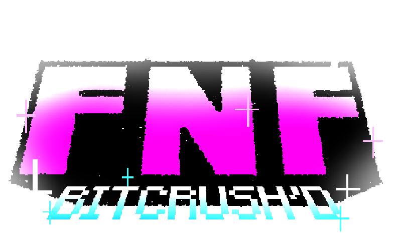

Mod of the original game using [Friday Night Funkin' - Psych Engine](https://gamebanana.com/mods/309789), [BITCRUSH'D](https://gamebanana.com/mods/682263) alters the art direction, story and world building within the new universe. Boyfriend, Girlfriend and the rest of the Funkin' crew decides to jump their original universe and meet more people and characters from fiction. Similarly as other mods that have put BF and GF in any circumstance, within BITCRUSH'D, it's all apart of ONE universe and they can hop to different ones as they please, interesting power indeed. Don't you think?

## Credits:
* o2hirayu - Owner, Director, Art Director, Lead Artist and Animator, Lead Composer, Leader Charter
* Seat499Fearful - Menu Programmer, Legacy Animator, Composer and Charter and Fan Artist
* stev_minecraf - Lead Programmer, Menu Programmer
* NathanTheFunker - Additional Programmer (Events)
* notshihu - Composer and Charter
* pokie29 - Composer
* chixd/chi1 - Composer
* comicaaron - Composer

### Special Thanks
* Axy - Supporter
* Feebs/rainbrain._ - Supporter and Fan Artist
* CoolDudeLikesThings - Supporter and Fan Artist
* PK - Supporter

_____________________________________

## Credits:
* Shadow Mario - Programmer
* RiverOaken - Artist
* Yoshubs - Assistant Programmer

### Special Thanks
* bbpanzu - Ex-Programmer
* shubs - New Input System
* SqirraRNG - Crash Handler and Base code for Chart Editor's Waveform
* KadeDev - Fixed some cool stuff on Chart Editor and other PRs
* iFlicky - Composer of Psync and Tea Time, also made the Dialogue Sounds
* PolybiusProxy - .MP4 Video Loader Library (hxCodec)
* Keoiki - Note Splash Animations
* Smokey - Sprite Atlas Support
* Nebula the Zorua - LUA JIT Fork and some Lua reworks